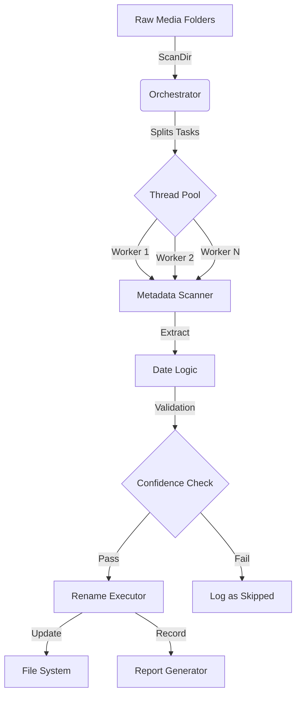

# EXIF Parallel Organizer

A high-performance Python script designed to automatically organize and rename large collections of media folders. Leveraging multi-threading, this tool processes folders in parallel to drastically reduce execution time. It intelligently extracts creation dates from images and videos and uses a confidence-based system to ensure accuracy.

## Key Features

*   **🚀 High-Speed Parallel Processing:** Utilizes a multi-threaded worker pool to process multiple folders concurrently, making it exceptionally fast for organizing large archives with hundreds or thousands of directories.
*   **🧠 Intelligent Date Extraction:** Accurately extracts creation dates from a wide range of image formats (JPG, JPEG, PNG, TIFF, HEIC) and video formats (MP4, MOV, AVI, MKV, 3GP, M4V).
*   **✅ Confidence-Based Renaming:** Employs a customizable confidence threshold to prevent incorrect renames, skipping folders where date metadata is ambiguous or insufficient.
*   **🛡️ Safe Dry Run Mode:** Includes a dry-run mode by default, allowing you to preview all proposed changes safely before any modifications are made to your file system.
*   **📊 Comprehensive Reporting:** Provides a detailed summary at the end of each run, showing renamed, skipped, unchanged, and errored folders, with a sample list of skipped items for quick review.
*   **✍️ Detailed Logging:** All operations are meticulously logged to `exif-organizer-parallel.log` for easy auditing and debugging.

## Tech Stack

*   **Language:** Python 3.8+
*   **Core Libraries:**
    *   `Pillow` (Image classification & EXIF data)
    *   `hachoir` (Video metadata extraction)
    *   `pillow-heif` (HEIF/HEIC support)
    *   `tqdm` (Progress bars)

## Architecture

The system follows a linear pipeline architecture optimized for parallel execution:



1.  **Input:** User provides a root directory containing messy folders.
2.  **Orchestrator:** Scans the root directory and creates a job for each sub-folder.
3.  **Thread Pool:** Distributes jobs to available worker threads (default: 4).
4.  **Metadata Scanner:** Each worker identifies image/video files and extracts creation timestamps using `Pillow` (images) or `hachoir` (videos).
5.  **Decision Engine:** Calculates the most frequent date in the folder. If the frequency exceeds the confidence threshold (default 60%), it approves the rename.
6.  **Rename Executor:** Renames the folder to `YYYY-MM-DD <Original Name>`. In `--dry-run` mode, it only simulates this.
7.  **Reporting:** Generates a JSON report and a Bash undo script.

## Setup Commands

Ensure you have Python 3 installed.

1.  **Clone the repository:**
    ```bash
    git clone https://github.com/N4Z1T/exif-parallel-organizer.git
    cd exif-parallel-organizer
    ```

2.  **Install core dependencies:**
    ```bash
    pip install Pillow requests tqdm
    ```

3.  **Install optional dependencies (highly recommended for full functionality):**
    *   **Video Metadata (Hachoir):** Essential for robust video date extraction.
        ```bash
        pip install hachoir
        ```
    *   **HEIC Support (Pillow-Heif):** Enables date extraction from Apple's HEIC image format.
        ```bash
        pip install pillow-heif
        ```

## Usage

Run the script from your terminal, pointing it at the directory containing your media folders.

```bash
python exif-parallel-organizer.py <path_to_target_folder> [OPTIONS]
```

### Arguments

*   `<path_to_target_folder>` (Required): The path to the root directory containing the folders you want to organize.

### Options

*   `--workers <number>`: Sets the number of parallel threads. **Default is half of your system's CPU threads** (e.g., 4 on an 8-thread CPU). Adjust this based on your system's capability.
*   `--live`: **Executes the renaming operations.** Without this flag, the script performs a safe dry run.
*   `--confidence <value>`: Sets the minimum confidence level (0.0 to 1.0) required to rename a folder. Default is `0.6`.
*   `--case <type>`: Defines the casing for folder names (`title`, `upper`, `lower`, `sentence`). Default is `title`.
*   `--non-interactive`: (Reserved for future use) Auto-skips any interactive prompts.

## Examples

**1. Dry Run with 8 Parallel Workers:**
Preview the changes using 8 threads for faster scanning.

```bash
python exif-parallel-organizer.py /path/to/my/media --workers 8
```

**2. Live Run with Custom Confidence:**
Execute the renaming process requiring 75% date confidence.

```bash
python exif-parallel-organizer.py "C:\Users\MyUser\Pictures\Vacation Photos" --live --confidence 0.75
```

## How It Works

The script's parallel architecture is designed for maximum efficiency:

1.  **Initialization:** The script first identifies all subdirectories in the target path.
2.  **Worker Pool:** A `ThreadPoolExecutor` is created with a user-defined number of worker threads.
3.  **Job Distribution:** Each folder is submitted as a separate job to the thread pool. A `tqdm` progress bar tracks the completion of these high-level tasks.
4.  **Parallel File Scanning:** Inside each worker thread, the script scans all media files within its assigned folder to collect creation dates. This I/O-bound task runs concurrently across all workers.
5.  **Execution or Simulation:** After determining the correct new name, the worker renames the folder (if in `--live` mode) or logs the proposed change (if in dry-run mode). Console output is also synchronized with a lock to prevent garbled text.
7.  **Result Aggregation:** The main thread collects the results (renamed, skipped, etc.) from each completed worker.
8.  **Final Report:** Once all folders have been processed, a final, clean report is printed to the console, summarizing the entire operation.

## Contributing

Contributions, issues, and feature requests are welcome! Feel free to check the [issues page](https://github.com/N4Z1T/exif-parallel-organizer/issues) or fork the repository and submit pull requests.

## License

This project is licensed under the MIT License.
